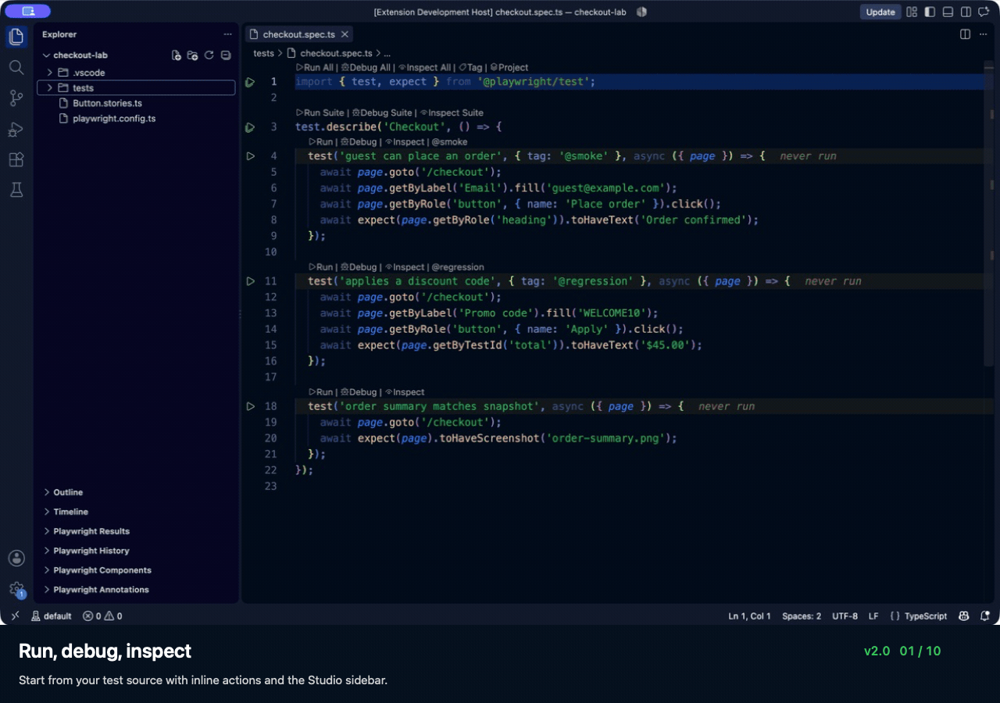

# Playwright Studio — Test Runner & Snippets

**Run a test. Inspect the page. Reproduce the failure.**

Playwright Studio brings test execution, live selector inspection, failure investigation, and **338 JavaScript and TypeScript snippets** into VS Code. Version 2 adds a dedicated testing sidebar, reusable run presets, captured artifacts, and local workflows for reproducing failures and checking repairs.

**[Install Playwright Studio](https://marketplace.visualstudio.com/items?itemName=sumanthtps.playwright-test-code-snippets)** · [Quick start](#your-first-test-run) · [Setup & troubleshooting](docs/guide.md) · [All features](docs/features.md) · [Report a problem](https://github.com/sumanthtps/playwright-studio/issues/new/choose)

## Spend less time rebuilding the same test run

| When you need to… | Use Studio to… |
| --- | --- |
| Reproduce a failure in one browser or environment | Save projects, tags, retries, and environment settings as a reusable run preset. |
| Understand what failed | Review attempts, output, screenshots, and available traces beside your test source. |
| Return to a previous failure | Browse local run history and compare captured outcomes. |
| Write the next test | Type `p-` for snippets, navigate fixtures, and apply supported locator quick fixes. |
| Find a locator that matches the right element | Open Selector Intelligence, inspect the live page, and compare ranked locators with match counts. |
| Reproduce a difficult condition | Use Scenario Lab for latency, HTTP errors, offline mode, and browser-clock changes. |



A 48-second feature tour using VS Code captures and the current extension's browser-rendered panels, with local sample data. [Browse the scenes and reproduction steps](docs/tour.md).

## What's new in v2

- **A testing sidebar:** discover files, suites and runtime cases; run, debug or inspect them from Studio's Tests view. Results, History and Features stay close to the editor.
- **Selector Intelligence:** browse a website inside the extension, inspect an element, and compare Playwright, CSS and XPath candidates. Check uniqueness, copy a locator, or open full Chrome DevTools attached to the same page. [Selector guide](docs/features.md#openselectorintelligence).
- **An investigation workspace:** search 15 Intelligence workflows, including Failure Detective, Scenario Lab, Test the Tests and Verified Repair. Each workflow explains its prerequisites and produces reviewable evidence. [Intelligence guide](docs/intelligence.md).
- **Advanced experiments:** capture reviewed failures in Bug Capsules, compare branch conditions, test Product Laws, challenge repairs, compare behavior and revisit incidents. Journey and agent experiments use your configured adapters. [Advanced workflow guide](docs/lab.md).
- **Local, reusable evidence:** preserve run history, attempts, output and available artifacts. Keep Studio configuration and generated helpers in VS Code workspace storage, outside your project repository.

## Your first test run

1. **Install** from the Marketplace. Open a trusted folder with Playwright installed and a `playwright.config.*` file. Requires VS Code 1.70.0 or newer. Native Test Coverage and continuous runs are available when supported by your VS Code version.
2. **Open a test** such as `checkout.spec.ts`. Click **Run** above the test, or use **Playwright Studio → Tests** in the activity bar.
3. **Review the result** in **Results**. For failures, open available attachments or traces; choose **Run Failed Tests** to retry.

A standard project needs **no extension settings or reporter edits**. Studio adds result capture to its own runs and retains your existing reporters.

Prefer the terminal? Install with:

```sh
code --install-extension sumanthtps.playwright-test-code-snippets
```

**New to Playwright?** Set up your project using the [Playwright installation guide](https://playwright.dev/docs/intro), then open it in VS Code. **No tests showing?** Run **Playwright Studio: Run Configuration Health Check** from the Command Palette. [Custom commands, monorepos, and troubleshooting](docs/guide.md).

## Start small, add tools when you need them

Start with **Tests**, **Results**, and snippets. Saved presets and history are available when you need repeatable runs. Coverage import and the advanced experiment workflows are optional; [browse their guides](docs/features.md) when they fit your work.

- **Uses your project:** Studio runs your installed Playwright CLI and configuration.
- **Local results:** Captured results and history live in VS Code extension storage. Studio does not add analytics telemetry; tests and explicitly invoked external tools may use the network.
- **Clear coverage labels:** Test recency highlights show which tests ran recently. Application line coverage requires an Istanbul/V8 coverage import.
- **Independent extension:** Playwright Studio is a community project, not affiliated with Microsoft. If another test extension is installed, both may contribute test trees and editor actions.

[Security behavior and limits](docs/security-review.md) · [Validation guide](test/README.md) · [Release notes](CHANGELOG.md)

<!-- feature-catalog:start -->
## Features

Each of the **98 entries** below has its own description. Open **Playwright Studio → Features** in the sidebar, or run **Playwright Studio: Open Feature Catalog**. Entries include all **76 commands** and editor integrations; all **338 snippets** are listed in the [snippet reference](#snippets-reference).

<details>
<summary>Explore all features and commands</summary>

### Editor and sidebar features

| Feature | What it does |
| --- | --- |
| [338 JavaScript and TypeScript snippets](docs/features.md#snippets) | Type p- in JavaScript, TypeScript, JSX or TSX to browse test, locator, assertion, API, network, browser and other snippet families. |
| [Native Test Explorer](docs/features.md#test-discovery) | Discover files, suites and tests in the Studio Tests view and VS Code Testing view; captured runtime cases extend static discovery. |
| [Continuous test runs](docs/features.md#continuous-runs) | Enable continuous runs through the native Testing API to rerun selected tests when relevant files change. |
| [Editor CodeLens actions](docs/features.md#codelens) | Use inline Run, Debug and Inspect actions above tests and suites, including tag actions. |
| [Automatic result capture](docs/features.md#result-capture) | Studio adds its capture reporter at run time while preserving existing reporters; normal extension runs need no JSON reporter edit. |
| [Results sidebar](docs/features.md#results-tree) | Browse captured passed, failed, flaky and skipped outcomes, project groups and source locations. |
| [Test status in the editor gutter](docs/features.md#failure-gutter) | See pass, failure, flaky and skipped status beside test source lines. |
| [Failure diagnostics in Problems](docs/features.md#failure-problems) | Navigate captured failures through the Problems panel with messages and available trace links. |
| [Attempts, steps and output](docs/features.md#captured-evidence) | Inspect captured attempts, step summaries, stdout/stderr, attachments and source/runtime metadata through results and evidence reports. |
| [Persistent run history](docs/features.md#persistent-history) | Retain workspace run summaries and outcomes between VS Code sessions and navigate back to their source. |
| [Environment and run status bar](docs/features.md#status-bar) | See the selected environment and most recent run summary in the VS Code status bar. |
| [Test recency highlights](docs/features.md#recency-heatmap) | Highlight test coverage recency from captured results; this is separate from measured application line coverage. |
| [Go to fixture definition](docs/features.md#fixture-definition) | Jump from a custom fixture parameter to its workspace definition. |
| [Fixture hover information](docs/features.md#fixture-hover) | Hover over a fixture parameter to inspect its definition and source link. |
| [Locator diagnostics](docs/features.md#locator-diagnostics) | Optionally highlight supported legacy selector patterns and suggest more maintainable locators. Enable playwrightSnippets.editorDiagnostics to show editor diagnostics. |
| [Locator quick fixes](docs/features.md#locator-quick-fixes) | Apply supported semantic locator or legacy API replacements through editor quick fixes. |
| [Components sidebar](docs/features.md#component-sidebar) | Discover component tests and stories and navigate to their source. |
| [Tags and annotations sidebar](docs/features.md#annotations-sidebar) | Browse captured tags, test annotations and quarantine context with source navigation. |
| [Automatic project detection](docs/features.md#config-detection) | Find the nearest supported Playwright configuration and resolve runs in the appropriate project or workspace root. |
| [Studio and lab JSON validation](docs/features.md#json-config) | Get validation and completions for local Studio and Lab configuration in VS Code workspace storage. |
| [Keyboard shortcuts](docs/features.md#keyboard-shortcuts) | Run the test at the cursor with Ctrl+Alt+R (Cmd+Alt+R on macOS) or open tag/grep selection with Ctrl+Alt+T (Cmd+Alt+T). |
| [Getting started walkthrough](docs/features.md#getting-started) | Use VS Code Get Started to learn editor execution, Codegen and trace/report inspection. |

### Run and debug

| Feature | What it does |
| --- | --- |
| [Run Test](docs/features.md#runtest) | Run one test or suite selected from the active test file. |
| [Run All Tests in File](docs/features.md#runfile) | Run every test in the active or selected test file. |
| [Debug Test](docs/features.md#debugtest) | Run a selected test under the VS Code debugger with breakpoints. |
| [Debug All Tests in File](docs/features.md#debugfile) | Debug every test in a file with the VS Code debugger. |
| [Inspect Test](docs/features.md#inspecttest) | Run a selected test with Playwright Inspector. |
| [Inspect All Tests in File](docs/features.md#inspectfile) | Run a file with Playwright Inspector. |
| [Debug Test with Inspector](docs/features.md#debuginspecttest) | Use VS Code debugging and Playwright Inspector together for a selected test. |
| [Debug All Tests with Inspector](docs/features.md#debuginspectfile) | Use VS Code debugging and Playwright Inspector together for a test file. |
| [Run Test at Cursor](docs/features.md#runtestatcursor) | Run the test at the editor cursor using its source line. |
| [Inspect Test at Cursor](docs/features.md#inspecttestatcursor) | Open Playwright Inspector for the test at the editor cursor. |
| [Run Tests](docs/features.md#runexplorertests) | Run the selected test, suite or file from the Tests sidebar, or all discovered tests from its toolbar. |
| [Debug Tests](docs/features.md#debugexplorertests) | Debug the selected sidebar tests, or all discovered tests from its toolbar. |
| [Inspect Tests](docs/features.md#inspectexplorertests) | Open selected tests, suites or files in Playwright Inspector from the eye icon beside Run and Debug. |
| [Refresh Tests](docs/features.md#refreshtests) | Refresh source discovery in the Studio sidebar and native Test Explorer. |
| [Open Playwright UI Mode](docs/features.md#openuimode) | Launch Playwright UI Mode for interactive test execution and inspection. |
| [Watch Current Test File in UI Mode](docs/features.md#watchfile) | Launch UI Mode scoped to the current test file for reruns while editing. |
| [Cancel All Runs](docs/features.md#cancelruns) | Stop the extension's active test tasks and debug sessions, including the current experiment execution. |

### Run selection and configuration

| Feature | What it does |
| --- | --- |
| [Run Tests with Tag / Grep Filter](docs/features.md#runwithtag) | Select a discovered tag or enter a grep expression to filter tests. |
| [Run Tests with Project Selection](docs/features.md#runwithproject) | Choose one or more configured Playwright browser projects. |
| [Run with Matrix Options](docs/features.md#runmatrix) | Choose scope, projects, grep, headed mode, workers, retries, repetitions, timeouts, trace/video policies, shards and snapshot options; optionally save a preset. |
| [Run Saved Preset](docs/features.md#runpreset) | Run a saved combination of test scope, projects, options and environment profile. |
| [Manage Saved Run Presets](docs/features.md#managerunpresets) | Rename, duplicate, edit, delete or run saved presets. |
| [Run Failed Tests](docs/features.md#runfailed) | Rerun failed tests from the latest captured results. |
| [Run Last Failed](docs/features.md#runlastfailed) | Use Playwright's last-failed selection for the project. |
| [Repeat Until Failure](docs/features.md#repeatuntilfailure) | Repeat a selected test with an iteration limit and stop on failure. |
| [Run a Shard](docs/features.md#runshard) | Run one numbered shard of the selected test suite. |
| [Copy Sharded CI Command](docs/features.md#copycicommand) | Copy a Playwright command with sharding options for use in CI. |

### Results and artifacts

| Feature | What it does |
| --- | --- |
| [Set Up Result Capture (Add JSON Reporter)](docs/features.md#setupcaptureresults) | Optionally add JSON reporting to the project config for runs outside Studio; extension-managed runs already capture results automatically. |
| [Show Trace Viewer](docs/features.md#showtrace) | Open a captured or selected trace archive in Playwright Trace Viewer. |
| [Show HTML Report](docs/features.md#showreport) | Open the project's Playwright HTML report. |
| [Open Test Artifact](docs/features.md#openartifact) | Inspect captured screenshot, video, trace and other test attachments. |
| [Review and Accept Snapshot Artifacts](docs/features.md#reviewsnapshots) | Review expected, actual and diff attachments and choose whether to accept a snapshot. |
| [Update Screenshots and ARIA Snapshots](docs/features.md#updatesnapshots) | Rerun tests with screenshot and ARIA snapshot updates enabled. |
| [Set Up Video Policy Override](docs/features.md#setupvideooverride) | Set up the optional config hook that allows Studio's video policy override to take effect. |

### History and test health

| Feature | What it does |
| --- | --- |
| [Show Flaky and Duration Analytics](docs/features.md#showanalytics) | Review flaky tests, failure frequency and test durations from captured run history. |
| [Compare Two Runs](docs/features.md#compareruns) | Compare outcomes and timing between two saved runs. |
| [Open Run History as Markdown](docs/features.md#exporthistory) | Open the workspace's recorded run history as Markdown. |
| [Clear Run History](docs/features.md#clearhistory) | Remove saved run history after confirmation. |
| [Quarantine Test at Cursor](docs/features.md#quarantinetest) | Mark the test at the cursor as quarantined with a reason. |
| [Remove Test Quarantine at Cursor](docs/features.md#unquarantinetest) | Remove the quarantine marker from the test at the cursor. |

### Writing and maintaining tests

| Feature | What it does |
| --- | --- |
| [Open Codegen](docs/features.md#codegen) | Launch Playwright Codegen to record interactions and generate tests. |
| [Open Live Locator Picker](docs/features.md#openlocatorpicker) | Launch the live Playwright locator picker for a target page. |
| [Save Selection as Snippet](docs/features.md#saveassnippet) | Save the selected editor text as a reusable snippet in the current VS Code profile. |
| [Open Component Testing Gallery](docs/features.md#opencomponentgallery) | Browse component test files and Storybook stories discovered in the workspace. |
| [Initialize Playwright Test Agents](docs/features.md#initializeagents) | Initialize Playwright's supported test-agent files in the project. |
| [Create Test Plan with Planner Agent](docs/features.md#generatetestplan) | Hand a planning prompt to a supported installed agent workflow for review. |
| [Generate Tests from Reviewed Plan](docs/features.md#generatetestsfromplan) | Hand a reviewed plan to the test-generation agent workflow. |
| [Heal Captured Failures with Agent](docs/features.md#healfailures) | Prepare a healer-agent handoff using captured failing-test evidence. |
| [Open Selector Intelligence](docs/features.md#openselectorintelligence) | Browse a website inside VS Code, inspect an element, and compare live-verified Playwright locators, CSS selectors and XPath with uniqueness counts. |

### Projects and environments

| Feature | What it does |
| --- | --- |
| [Switch Environment Profile](docs/features.md#switchenvprofile) | Choose a named environment profile for subsequent runs. |
| [Select .env File](docs/features.md#selectenvfile) | Choose an optional .env file whose values are loaded for execution. |
| [Open Multi-Root Workspace Dashboard](docs/features.md#openworkspacedashboard) | Review detected Playwright roots across a multi-root workspace. |
| [Show Project Dependency Graph](docs/features.md#showprojectgraph) | Display configured Playwright projects and their dependencies. |
| [Run Configuration Health Check](docs/features.md#healthcheck) | Check project detection, configuration, execution settings and result/report paths. |
| [Install Playwright Browsers](docs/features.md#installbrowsers) | Install Playwright browser binaries using the project's tool command. |
| [Update Playwright Browsers](docs/features.md#updatebrowsers) | Refresh the browser binaries for the project's installed Playwright version. |

### Coverage and sharing

| Feature | What it does |
| --- | --- |
| [Import Istanbul/V8 Coverage](docs/features.md#importcoverage) | Import existing Istanbul or V8 coverage into VS Code's native test coverage UI. |
| [Export Latest Results](docs/features.md#exportresults) | Export the latest captured results as Markdown, JSON or JUnit XML, or copy a summary. |
| [Post Latest Results to GitHub](docs/features.md#postgithubcomment) | Review the destination and confirm before posting a captured result summary through GitHub CLI. |

### Playwright Intelligence

| Feature | What it does |
| --- | --- |
| [Open Intelligence Dashboard](docs/features.md#openintelligence) | Open the dashboard containing all 15 intelligence and advanced testing workflows. |
| [Investigate Failures](docs/features.md#investigatefailures) | Failure Detective groups captured failures using signatures, traces and source evidence; explanations are investigation hypotheses. |
| [Test the Tests with Mutations](docs/features.md#testthetests) | Challenge selected tests with isolated application mutations, comparing a passing baseline with each changed source. |
| [Open Scenario Lab](docs/features.md#openscenariolab) | Save and run latency, HTTP error, offline and clock scenarios; compare against baseline and reduce failing recipes. |
| [Show Living Behavior Map](docs/features.md#showbehaviormap) | Index literal routes, semantic UI roles, steps, assertions, imports and promise links into a Living Behavior Map. |
| [Show Change Radar](docs/features.md#showchangeradar) | Select checks for changed files under a time budget using imports, coverage links, history, promises and recorded incidents. |
| [Verify a Candidate Repair](docs/features.md#verifyrepair) | Reproduce the original failure, audit a candidate test repair and run it repeatedly in an isolated copy before review. |
| [Benchmark Human and Agent Journeys](docs/features.md#benchmarkjourneys) | Compare scripted human-style interactions with user-supplied agent adapters against shared success criteria. |
| [Manage Product Promises](docs/features.md#managepromises) | Record observable product promises, owners, priority and linked tests, then inspect evidence freshness for the current source. |

### Advanced testing workflows

| Feature | What it does |
| --- | --- |
| [Open Bug Capsules](docs/features.md#openbugcapsules) | Capture reviewed, checksummed source bundles that reproduce a failure; inspect or reproduce imported capsules in disposable copies. |
| [Branch the Failure](docs/features.md#branchfailure) | Rerun a journey with checkpoint-triggered network, cookie, offline, clock or misleading-text conditions and compare observed outcomes. |
| [Check Product Laws](docs/features.md#checkproductlaws) | Run seeded sequences against a user-defined business invariant, reduce reproduced failures and export regression tests. |
| [Open Agent Wind Tunnel](docs/features.md#openagentwindtunnel) | Compare user-supplied agent adapters across model labels and branch conditions using measured completion, forbidden actions, recovery and cost. |
| [Challenge a Candidate Repair](docs/features.md#challengerepair) | Challenge a candidate repair with known application defects as negative controls, alongside failure reproduction and repeated candidate runs. |
| [Compare Runtime Behavior Across Revisions](docs/features.md#showbehaviordiff) | Run selected journeys against a Git revision and the saved workspace, comparing outcomes, ARIA snapshots, focus, URLs and response statuses. |
| [Open Incident Memory](docs/features.md#openincidentmemory) | Record and exchange incident summaries, regression links and optional negative controls; validate them and feed affected files into Change Radar. |

### Feature discovery

| Feature | What it does |
| --- | --- |
| [Open Feature Catalog](docs/features.md#openfeaturecatalog) | Open this complete feature catalog; the Features sidebar lists each entry separately with a description. |

</details>
<!-- feature-catalog:end -->

Editor error highlights and locator suggestions are disabled by default. Enable `playwrightSnippets.editorDiagnostics` to show them in the editor and Problems panel. Test results remain available in Studio and Test Explorer.

## Local workspace data

Studio configs, generated helpers and run data stay in VS Code workspace storage outside your repository, without editing ignore files. Existing `.playwright-studio` data migrates with verified copies and conflict checks. Use **Edit configuration** or **Edit lab configuration** in the Intelligence dashboard to open local configs.

## Selector Intelligence

Run **Playwright Studio: Open Selector Intelligence**, enter an HTTP or HTTPS URL, then click an element in the website preview. Compare ranked Playwright role, test ID, label, text, CSS and XPath locators with live match counts. Switch to **Browse**, click a field and type directly; Enter, Tab, selection shortcuts and plain-text paste work through the preview. Return to **Inspect** to choose a locator.

Use **Open Chrome DevTools** in the toolbar for full DevTools in a separate Chrome window attached to that same page. Close and reopen the Selector Intelligence tab to resume its live browser, mode and selector results within the same VS Code window. Reloading or exiting VS Code ends the session.

Use a trusted project with Playwright installed. If Playwright's Chromium is missing, the default browser selection tries installed Chrome and Edge. The panel also offers **Install Chromium** and browser recovery actions. Each session uses a separate browser profile.

The **eye icon beside Run and Debug** in the Tests view opens the selected test, suite or file in Playwright Inspector. [Selector setup and limitations](docs/selectors.md).

## Playwright Intelligence

Open **Playwright Studio: Open Intelligence Dashboard** for eight connected workflows: Failure Detective, Test the Tests, Scenario Lab, Living Behavior Map, Change Radar, Verified Repair, Human & Agent Journeys, and Product Promises.

Investigate captured failures, challenge assertions with isolated mutations, reproduce faults, select checks for a time budget, verify candidate repairs, and track behavior requirements against revision-specific evidence. [Workflow guide, configuration, and execution boundaries](docs/intelligence.md).

Seven additional workflows extend that evidence into portable **Bug Capsules**, checkpoint-based **Branch the Failure** experiments, seeded **Product Laws**, an **Agent Wind Tunnel**, negative-control **Repair Challenges**, runtime **Behavior Diff**, and **Incident Memory** connected to Change Radar. [Setup, adapter examples, and evidence limits](docs/lab.md).

## Shortcuts

| Action | Windows / Linux | macOS |
| --- | --- | --- |
| Run test at cursor | `Ctrl+Alt+R` | `Cmd+Alt+R` |
| Run with tag / grep | `Ctrl+Alt+T` | `Cmd+Alt+T` |

## Need a custom setup?

Most settings are optional. Use `playwrightSnippets.workingDirectory` to override project detection, `testCommand` for a custom runner, or `reportPath` for a custom HTML report directory. Search **Playwright Snippets** in VS Code Settings for the full list.

If a run fails to start or results are missing, run **Playwright Studio: Run Configuration Health Check**. The [setup and troubleshooting guide](docs/guide.md) covers monorepos, reporters, environments, and browser installation.

---

## Snippets Reference

Type `p-` to browse snippets, or expand the full reference below.

<details>
<summary>Browse all 338 snippet prefixes</summary>

### Prefix Families

| Prefix            | Category           |
| ----------------- | ------------------ |
| `p-import`        | Imports            |
| `p-t*`            | Test structure     |
| `p-b-*`           | Browser            |
| `p-bc-*`          | BrowserContext     |
| `p-loc-*`         | Locator            |
| `p-get-*`         | Locator getBy      |
| `p-e-*` / `p-et*` | Assertions         |
| `p-wf*`           | Wait actions       |
| `p-on-*`          | Page events        |
| `p-route-*`       | Network routing    |
| `p-clock-*`       | Clock / time       |
| `p-trace-*`       | Tracing            |
| `p-video-*`       | Video recording    |
| `p-api-*`         | API requests       |
| `p-net-*`         | Network inspection |
| `p-ws-*`          | WebSocket          |
| `p-download-*`    | Downloads          |

---

### Imports

| Prefix         | Description                        |
| -------------- | ---------------------------------- |
| `p-import`     | `import { test, expect }`          |
| `p-import-api` | `import { test, expect, request }` |
| `p-i-pw`       | `require('playwright')`            |
| `p-i-chromium` | `require` Chromium                 |
| `p-i-firefox`  | `require` Firefox                  |
| `p-i-webkit`   | `require` WebKit                   |
| `p-i-devices`  | `require` devices                  |

---

### Test Structure

| Prefix         | Description                         |
| -------------- | ----------------------------------- |
| `p-td`         | `test.describe()`                   |
| `p-t`          | `test()`                            |
| `p-ts`         | `test.step()`                       |
| `p-ts-timeout` | `test.step()` with timeout (v1.50+) |
| `p-ts-skip`    | `test.step.skip()` (v1.50+)         |
| `p-tbe`        | `test.beforeEach()`                 |
| `p-tae`        | `test.afterEach()`                  |
| `p-tba`        | `test.beforeAll()`                  |
| `p-taa`        | `test.afterAll()`                   |
| `p-tuse`       | `test.use()`                        |
| `p-tonly`      | `test.only()`                       |
| `p-tskip`      | `test.skip()`                       |
| `p-tskipc`     | `test.skip()` conditional           |
| `p-tfail`      | `test.fail()`                       |
| `p-tfail-only` | `test.fail.only()` (v1.49+)         |
| `p-tfixme`     | `test.fixme()`                      |
| `p-tslow`      | `test.slow()`                       |
| `p-t-timeout`  | `test.setTimeout()`                 |
| `p-tinfo`      | `test.info()`                       |
| `p-textend`    | `test.extend()` — custom fixtures   |
| `p-tdo`        | `test.describe.only()`              |
| `p-tdp`        | `test.describe.parallel()`          |
| `p-tds`        | `test.describe.serial()`            |
| `p-td-config`  | `test.describe.configure()`         |

---

### Browser

| Prefix                | Description                    |
| --------------------- | ------------------------------ |
| `p-b-newContext`      | `browser.newContext()`         |
| `p-b-newPage`         | `browser.newPage()`            |
| `p-b-contexts`        | `browser.contexts()`           |
| `p-b-close`           | `browser.close()`              |
| `p-b-isConnected`     | `browser.isConnected()`        |
| `p-b-version`         | `browser.version()`            |
| `p-b-type`            | `browser.browserType().name()` |
| `p-b-on-disconnected` | `browser.on('disconnected')`   |
| `p-b-tracing-start`   | `browser.startTracing()`       |
| `p-b-tracing-stop`    | `browser.stopTracing()`        |
| `p-l-chromium`        | Launch Chromium                |
| `p-ls-chromium`       | Launch Chromium Server         |
| `p-connect-chromium`  | Connect to Chromium            |
| `p-l-firefox`         | Launch Firefox                 |
| `p-ls-firefox`        | Launch Firefox Server          |
| `p-connect-firefox`   | Connect to Firefox             |
| `p-l-webkit`          | Launch WebKit                  |
| `p-ls-webkit`         | Launch WebKit Server           |
| `p-connect-webkit`    | Connect to WebKit              |
| `p-bs-close`          | `browserServer.close()`        |
| `p-bs-kill`           | `browserServer.kill()`         |
| `p-bs-on-close`       | `browserServer.on('close')`    |

---

### BrowserContext

| Prefix              | Description                                 |
| ------------------- | ------------------------------------------- |
| `p-context-newPage` | `context.newPage()`                         |
| `p-context-pages`   | `context.pages()`                           |
| `p-bc-close`        | `context.close()`                           |
| `p-bc-cookies`      | `context.cookies()`                         |
| `p-bc-addcookies`   | `context.addCookies()`                      |
| `p-bc-clrcookies`   | `context.clearCookies()`                    |
| `p-bc-storage`      | `context.storageState()` — save auth        |
| `p-bc-auth`         | `newContext({ storageState })` — reuse auth |
| `p-bc-route`        | `context.route()`                           |
| `p-bc-routehar`     | `context.routeFromHAR()`                    |
| `p-bc-ws-route`     | `context.routeWebSocket()` (v1.48+)         |
| `p-bc-unroute`      | `context.unroute()`                         |
| `p-bc-unroute-all`  | `context.unrouteAll()`                      |
| `p-bc-gperm`        | `context.grantPermissions()`                |
| `p-bc-clrperm`      | `context.clearPermissions()`                |
| `p-bc-setgeo`       | `context.setGeolocation()`                  |
| `p-bc-offline`      | `context.setOffline()`                      |
| `p-bc-sethdrs`      | `context.setExtraHTTPHeaders()`             |
| `p-bc-ais`          | `context.addInitScript()`                   |
| `p-bc-expfn`        | `context.exposeFunction()`                  |
| `p-bc-expbind`      | `context.exposeBinding()`                   |
| `p-bc-sdto`         | `context.setDefaultTimeout()`               |
| `p-bc-sdnto`        | `context.setDefaultNavigationTimeout()`     |
| `p-bc-wfe`          | `context.waitForEvent()`                    |
| `p-bc-cdp`          | `context.newCDPSession()` (Chromium)        |
| `p-bc-on-close`     | `context.on('close')`                       |
| `p-bc-on-page`      | `context.on('page')`                        |
| `p-bc-on-weberror`  | `context.on('weberror')`                    |

---

### Page — Navigation & Interaction

| Prefix           | Description            |
| ---------------- | ---------------------- |
| `p-goto`         | `page.goto()`          |
| `p-reload`       | `page.reload()`        |
| `p-goBack`       | `page.goBack()`        |
| `p-goFwd`        | `page.goForward()`     |
| `p-setcontent`   | `page.setContent()`    |
| `p-url`          | `page.url()`           |
| `p-title`        | `page.title()`         |
| `p-content`      | `page.content()`       |
| `p-pause`        | `page.pause()` — debug |
| `p-iclosed`      | `page.isClosed()`      |
| `p-ctx`          | `page.context()`       |
| `p-opener`       | `page.opener()`        |
| `p-close`        | `page.close()`         |
| `p-bringToFront` | `page.bringToFront()`  |

### Page — Locating Elements

| Prefix        | Description               |
| ------------- | ------------------------- |
| `p-locator`   | `page.locator()`          |
| `p-fl`        | `page.frameLocator()`     |
| `p-frames`    | `page.frames()`           |
| `p-frame`     | `page.frame()`            |
| `p-mainframe` | `page.mainFrame()`        |
| `p-get-txt`   | `page.getByText()`        |
| `p-get-r`     | `page.getByRole()`        |
| `p-get-l`     | `page.getByLabel()`       |
| `p-get-ti`    | `page.getByTestId()`      |
| `p-get-p`     | `page.getByPlaceholder()` |
| `p-get-atxt`  | `page.getByAltText()`     |
| `p-get-title` | `page.getByTitle()`       |
| `p-$`         | Create a locator           |
| `p-$$`        | `locator.all()`            |
| `p-$eval`     | `locator.evaluate()`       |
| `p-$$eval`    | `locator.evaluateAll()`    |

### Page — Actions

| Prefix     | Description              |
| ---------- | ------------------------ |
| `p-clk`    | `page.click()`           |
| `p-dbclk`  | `locator.dblclick()`     |
| `p-clki`   | `page.nth().click()`     |
| `p-fill`   | `locator.fill()`         |
| `p-type`   | `locator.pressSequentially()` |
| `p-chk`    | `page.check()`           |
| `p-uchk`   | `page.uncheck()`         |
| `p-hover`  | `page.hover()`           |
| `p-focus`  | `locator.focus()`        |
| `p-press`  | `locator.press()`        |
| `p-so`     | `page.selectOption()`    |
| `p-sif`    | `page.setInputFiles()`   |
| `p-dnd`    | `page.dragAndDrop()`     |
| `p-svp`    | `page.setViewportSize()` |
| `p-emedia` | `page.emulateMedia()`    |

### Page — State & Evaluation

| Prefix        | Description                  |
| ------------- | ---------------------------- |
| `p-isv`       | `page.isVisible()`           |
| `p-ish`       | `page.isHidden()`            |
| `p-isc`       | `page.isChecked()`           |
| `p-isen`      | `page.isEnabled()`           |
| `p-isd`       | `page.isDisabled()`          |
| `p-ised`      | `page.isEditable()`          |
| `p-getattr`   | `page.getAttribute()`        |
| `p-itxt`      | `page.innerText()`           |
| `p-count`     | `page.count()`               |
| `p-eval`      | `page.evaluate()`            |
| `p-evalh`     | `page.evaluateHandle()`      |
| `p-ais`       | `page.addInitScript()`       |
| `p-addscript` | `page.addScriptTag()`        |
| `p-addstyle`  | `page.addStyleTag()`         |
| `p-expfn`     | `page.exposeFunction()`      |
| `p-expbind`   | `page.exposeBinding()`       |
| `p-sdto`      | `page.setDefaultTimeout()`   |
| `p-sethdrs`   | `page.setExtraHTTPHeaders()` |
| `p-reqgc`     | `page.requestGC()` (v1.48+)  |

### Page — Capture & Output

| Prefix                 | Description          |
| ---------------------- | -------------------- |
| `p-screenshot-full`    | Full page screenshot |
| `p-screenshot-element` | Element screenshot   |
| `p-pdf`                | `page.pdf()`         |

### Page — Debug & Inspection (v1.56+)

| Prefix           | Description              |
| ---------------- | ------------------------ |
| `p-console-msgs` | `page.consoleMessages()` |
| `p-page-errors`  | `page.pageErrors()`      |
| `p-page-reqs`    | `page.requests()`        |

### Page — Routing

| Prefix          | Description                                  |
| --------------- | -------------------------------------------- |
| `p-route`       | `page.route()`                               |
| `p-routehar`    | `page.routeFromHAR()`                        |
| `p-unroute`     | `page.unrouteAll()`                          |
| `p-unroute-url` | `page.unroute()` — specific URL              |
| `p-ws-route`    | `page.routeWebSocket()` (v1.48+)             |
| `p-alh`         | `page.addLocatorHandler()` — overlay handler |
| `p-rlh`         | `page.removeLocatorHandler()`                |
| `p-ral`         | `page.removeAllListeners()`                  |

---

### Locator Methods

| Prefix             | Description                                  |
| ------------------ | -------------------------------------------- |
| `p-loc-all`        | `locator.all()`                              |
| `p-loc-ait`        | `locator.allInnerTexts()`                    |
| `p-loc-atc`        | `locator.allTextContents()`                  |
| `p-loc-and`        | `locator.and()` — AND match                  |
| `p-loc-or`         | `locator.or()` — OR match                    |
| `p-loc-first`      | `locator.first()`                            |
| `p-loc-last`       | `locator.last()`                             |
| `p-loc-nth`        | `locator.nth()`                              |
| `p-loc-sub`        | `locator.locator()` — sub-locator            |
| `p-loc-clear`      | `locator.clear()`                            |
| `p-loc-blur`       | `locator.blur()`                             |
| `p-loc-tap`        | `locator.tap()`                              |
| `p-loc-press`      | `locator.press()`                            |
| `p-loc-pseq`       | `locator.pressSequentially()`                |
| `p-loc-drag`       | `locator.dragTo()`                           |
| `p-loc-stxt`       | `locator.selectText()`                       |
| `p-loc-sc`         | `locator.setChecked()`                       |
| `p-loc-siv`        | `locator.scrollIntoViewIfNeeded()`           |
| `p-loc-bbox`       | `locator.boundingBox()`                      |
| `p-loc-ival`       | `locator.inputValue()`                       |
| `p-loc-ihtml`      | `locator.innerHTML()`                        |
| `p-loc-tc`         | `locator.textContent()`                      |
| `p-loc-wf`         | `locator.waitFor()` — with state             |
| `p-loc-eval`       | `locator.evaluate()`                         |
| `p-loc-evalall`    | `locator.evaluateAll()`                      |
| `p-loc-de`         | `locator.dispatchEvent()`                    |
| `p-loc-cf`         | `locator.contentFrame()`                     |
| `p-loc-filter-vis` | `locator.filter({ visible: true })` (v1.51+) |
| `p-locator-filter` | `locator.filter()` — text/not                |
| `p-loc-describe`   | `locator.describe()` (v1.53+)                |
| `p-loc-hl`         | `locator.highlight()` — debug                |
| `p-loc-aria`       | `locator.ariaSnapshot()`                     |
| `p-loc-ss`         | `locator.screenshot()`                       |

---

### Wait Actions

| Prefix     | Description                  |
| ---------- | ---------------------------- |
| `p-wf`     | `locator.waitFor()`          |
| `p-loc-wf` | `locator.waitFor({ state })` |
| `p-wfs`    | `locator.waitFor()`          |
| `p-wfls`   | `page.waitForLoadState()`    |
| `p-wft`    | `page.waitForTimeout()`      |
| `p-wfe`    | `page.waitForEvent()`        |
| `p-wff`    | `page.waitForFunction()`     |
| `p-wfn`    | `page.waitForURL()`          |
| `p-wfreq`  | `page.waitForRequest()`      |
| `p-wfres`  | `page.waitForResponse()`     |
| `p-wfurl`  | `page.waitForURL()`          |

---

### Page Events

| Prefix                  | Description                   |
| ----------------------- | ----------------------------- |
| `p-on-close`            | `page.on('close')`            |
| `p-on-console`          | `page.on('console')`          |
| `p-on-crash`            | `page.on('crash')`            |
| `p-on-dialog`           | `page.on('dialog')`           |
| `p-on-domcontentloaded` | `page.on('domcontentloaded')` |
| `p-on-download`         | `page.on('download')`         |
| `p-on-filechooser`      | `page.on('filechooser')`      |
| `p-on-frameattached`    | `page.on('frameattached')`    |
| `p-on-framedetached`    | `page.on('framedetached')`    |
| `p-on-framenavigated`   | `page.on('framenavigated')`   |
| `p-on-load`             | `page.on('load')`             |
| `p-on-pageerror`        | `page.on('pageerror')`        |
| `p-on-popup`            | `page.on('popup')`            |
| `p-on-request`          | `page.on('request')`          |
| `p-on-requestfailed`    | `page.on('requestfailed')`    |
| `p-on-requestfinished`  | `page.on('requestfinished')`  |
| `p-on-response`         | `page.on('response')`         |
| `p-on-websocket`        | `page.on('websocket')`        |
| `p-on-worker`           | `page.on('worker')`           |

---

### Assertions

#### State Assertions

| Prefix         | Description                  |
| -------------- | ---------------------------- |
| `p-etbv`       | `toBeVisible()`              |
| `p-etbh`       | `toBeHidden()`               |
| `p-etbe`       | `toBeEnabled()`              |
| `p-etbd`       | `toBeDisabled()`             |
| `p-etbc`       | `toBeChecked()`              |
| `p-e-attached` | `toBeAttached()`             |
| `p-e-empty`    | `toBeEmpty()`                |
| `p-e-focused`  | `toBeFocused()`              |
| `p-e-viewport` | `toBeInViewport()`           |
| `p-e-editable` | `toBeEditable()`             |
| `p-e-ok`       | `toBeOK()` — response status |

#### Content Assertions

| Prefix          | Description                     |
| --------------- | ------------------------------- |
| `p-etb`         | `expect().toBe()`               |
| `p-ethtxt`      | `toHaveText()`                  |
| `p-etctxt`      | `toContainText()`               |
| `p-etht`        | `toHaveTitle()`                 |
| `p-ethURL`      | `toHaveURL()`                   |
| `p-ethattr`     | `toHaveAttribute()`             |
| `p-ethc`        | `toHaveCount()`                 |
| `p-ethss`       | `toHaveScreenshot()`            |
| `p-e-val`       | `toHaveValue()`                 |
| `p-e-vals`      | `toHaveValues()` — multi-select |
| `p-e-class`     | `toHaveClass()`                 |
| `p-e-contclass` | `toContainClass()` (v1.52+)     |
| `p-e-css`       | `toHaveCSS()`                   |
| `p-e-id`        | `toHaveId()`                    |
| `p-e-jsprop`    | `toHaveJSProperty()`            |
| `p-e-role`      | `toHaveRole()`                  |

#### Accessibility Assertions

| Prefix        | Description                               |
| ------------- | ----------------------------------------- |
| `p-e-accname` | `toHaveAccessibleName()`                  |
| `p-e-accdesc` | `toHaveAccessibleDescription()`           |
| `p-e-accerrm` | `toHaveAccessibleErrorMessage()` (v1.50+) |
| `p-e-aria`    | `toMatchAriaSnapshot()` (v1.49+)          |

#### Advanced Assertions

| Prefix            | Description                         |
| ----------------- | ----------------------------------- |
| `p-config-expect` | `expect.configure()` — soft/timeout |
| `p-e-poll`        | `expect.poll()` — polling           |
| `p-e-pass`        | `expect.toPass()` — retry block     |
| `p-soft-assert`   | Soft assertions block pattern       |

---

### Network Routing

| Prefix             | Description                                  |
| ------------------ | -------------------------------------------- |
| `p-route-fulfill`  | `route.fulfill()` — mock response            |
| `p-route-abort`    | `route.abort()` — block request              |
| `p-route-continue` | `route.continue()` — pass through with edits |
| `p-route-fallback` | `route.fallback()` — next handler            |
| `p-route-fetch`    | `route.fetch()` — fetch + modify             |
| `p-route-modify`   | Intercept and modify JSON response pattern   |
| `p-net-req`        | Inspect request (method, url, headers, body) |
| `p-net-res`        | Inspect response (status, url, json)         |
| `p-net-assert`     | Wait for and assert an API response          |

---

### WebSocket Routing

| Prefix           | Description                         |
| ---------------- | ----------------------------------- |
| `p-ws-route`     | `page.routeWebSocket()` (v1.48+)    |
| `p-bc-ws-route`  | `context.routeWebSocket()` (v1.48+) |
| `p-ws-mock`      | Full WebSocket mock pattern         |
| `p-on-websocket` | `page.on('websocket')`              |

---

### Clock API (v1.45+)

| Prefix            | Description                         |
| ----------------- | ----------------------------------- |
| `p-clock-install` | `page.clock.install()` — fake clock |
| `p-clock-fixed`   | `page.clock.setFixedTime()`         |
| `p-clock-systime` | `page.clock.setSystemTime()`        |
| `p-clock-ff`      | `page.clock.fastForward()`          |
| `p-clock-run`     | `page.clock.runFor()`               |
| `p-clock-pause`   | `page.clock.pauseAt()`              |
| `p-clock-resume`  | `page.clock.resume()`               |

---

### Tracing

| Prefix              | Description                              |
| ------------------- | ---------------------------------------- |
| `p-trace-start`     | `context.tracing.start()`                |
| `p-trace-stop`      | `context.tracing.stop()`                 |
| `p-trace-chunk`     | `context.tracing.startChunk()`           |
| `p-trace-stopchunk` | `context.tracing.stopChunk()`            |
| `p-trace-group`     | `context.tracing.group()` + `groupEnd()` |
| `p-trace-full`      | Full tracing setup (beforeAll/afterAll)  |

---

### Video Recording

| Prefix         | Description                   |
| -------------- | ----------------------------- |
| `p-video-ctx`  | `newContext({ recordVideo })` |
| `p-video-path` | `page.video().path()`         |
| `p-video-save` | `page.video().saveAs()`       |

---

### Downloads & File Chooser

| Prefix               | Description                      |
| -------------------- | -------------------------------- |
| `p-on-download`      | `page.on('download')` handler    |
| `p-download-full`    | Wait + save download pattern     |
| `p-download-path`    | `download.path()`                |
| `p-download-save`    | `download.saveAs()`              |
| `p-download-name`    | `download.suggestedFilename()`   |
| `p-on-filechooser`   | `page.on('filechooser')` handler |
| `p-filechooser-full` | Wait + set files pattern         |

---

### API Testing

| Prefix          | Description                         |
| --------------- | ----------------------------------- |
| `p-api-ctx`     | `request.newContext()`              |
| `p-api-get`     | `request.get()`                     |
| `p-api-post`    | `request.post()`                    |
| `p-api-put`     | `request.put()`                     |
| `p-api-patch`   | `request.patch()`                   |
| `p-api-del`     | `request.delete()`                  |
| `p-api-head`    | `request.head()`                    |
| `p-api-fetch`   | `request.fetch()` — custom method   |
| `p-api-storage` | `request.storageState()`            |
| `p-api-dispose` | `request.dispose()`                 |
| `p-req-get`     | `page.request.get()` — shares auth  |
| `p-req-post`    | `page.request.post()` — shares auth |

---

### Keyboard, Mouse & Touch

| Prefix                  | Description                  |
| ----------------------- | ---------------------------- |
| `p-keyboard-press`      | `page.keyboard.press()`      |
| `p-keyboard-down`       | `page.keyboard.down()`       |
| `p-keyboard-up`         | `page.keyboard.up()`         |
| `p-keyboard-type`       | `page.keyboard.type()`       |
| `p-keyboard-insertText` | `page.keyboard.insertText()` |
| `p-mouse-clk`           | `page.mouse.click()`         |
| `p-mouse-dbclk`         | `page.mouse.dblclick()`      |
| `p-mouse-down`          | `page.mouse.down()`          |
| `p-mouse-move`          | `page.mouse.move()`          |
| `p-mouse-up`            | `page.mouse.up()`            |
| `p-mouse-wheel`         | `page.mouse.wheel()`         |
| `p-touch-tap`           | `page.touchscreen.tap()`     |

---

### iFrame Handling

| Prefix        | Description                 |
| ------------- | --------------------------- |
| `p-fl`        | `page.frameLocator()`       |
| `p-fl-loc`    | `frameLocator.locator()`    |
| `p-fl-role`   | `frameLocator.getByRole()`  |
| `p-fl-nested` | Nested `frameLocator` chain |
| `p-loc-cf`    | `locator.contentFrame()`    |

---

### Dialog Handling

| Prefix             | Description            |
| ------------------ | ---------------------- |
| `p-on-dialog`      | `page.on('dialog')`    |
| `p-dialog-accept`  | Accept dialog pattern  |
| `p-dialog-dismiss` | Dismiss dialog pattern |

---

### Workers & Accessibility

| Prefix          | Description                     |
| --------------- | ------------------------------- |
| `p-on-worker`   | `page.on('worker')`             |
| `p-worker-eval` | `worker.evaluate()`             |
| `p-worker-url`  | `worker.url()`                  |
| `p-acc-snap`    | `page.ariaSnapshot()`          |

---

### Page Object Model (POM)

| Prefix   | Description                   |
| -------- | ----------------------------- |
| `p-pam`  | `public async method()`       |
| `m-pom`  | POM class template            |
| `m-pome` | POM class with extended class |

---

### Complete Patterns & Templates

| Prefix               | Description                           |
| -------------------- | ------------------------------------- |
| `p-sample`           | Basic Playwright test                 |
| `p-testBlock`        | Complete test block with describe     |
| `p-newPage`          | Handle new tab / popup page           |
| `p-newPopup`         | Handle popup window                   |
| `p-dragdrop-sample`  | Drag and drop with mouse              |
| `p-saveHAR`          | Record HAR file                       |
| `p-auth-setup`       | Global auth setup with `storageState` |
| `p-route-modify`     | Intercept and modify API response     |
| `p-soft-assert`      | Soft assertions block                 |
| `p-trace-full`       | Full tracing setup                    |
| `p-ws-mock`          | Mock WebSocket responses              |
| `p-download-full`    | Wait and save file download           |
| `p-filechooser-full` | Wait and handle file chooser          |
| `p-tls-cert`         | TLS client certificate setup (v1.46+) |
| `p-mobile`           | Mobile device emulation               |
| `p-config`           | Full `playwright.config.ts` template  |

---

</details>

## Feedback

Found a rough edge? [Report a bug](https://github.com/sumanthtps/playwright-studio/issues/new?template=bug_report.yml) with your VS Code version, Playwright version, and steps to reproduce. If Studio helps your workflow, an [honest Marketplace review](https://marketplace.visualstudio.com/items?itemName=sumanthtps.playwright-test-code-snippets&ssr=false#review-details) helps other developers decide whether it fits theirs.

## Links

- Marketplace: https://marketplace.visualstudio.com/items?itemName=sumanthtps.playwright-test-code-snippets
- Repository: https://github.com/sumanthtps/playwright-studio
- Issues & feature requests: https://github.com/sumanthtps/playwright-studio/issues

---

## License

MIT
